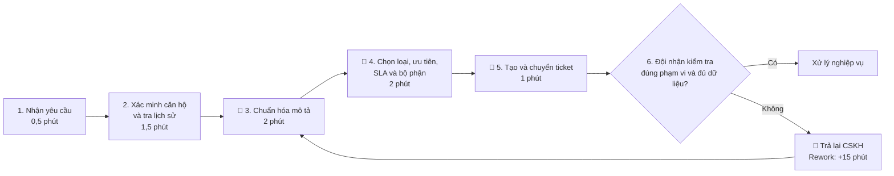
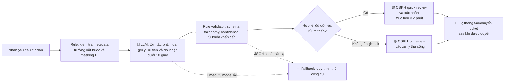

# Lab 02 — Deep-Dive Report: Phân loại và chuyển yêu cầu cư dân Vinhomes

## 1. Bối cảnh và phạm vi

Sau Phase 1 và Phase 2, bài toán được chọn để phân tích sâu là **hỗ trợ nhân viên CSKH phân loại và chuyển yêu cầu cư dân đến đúng bộ phận xử lý**.

Bài toán được ưu tiên vì có tần suất cao, đầu vào chủ yếu là ngôn ngữ tự do và tác động có thể đo bằng thời gian xử lý, tỷ lệ chuyển sai và SLA. Giải pháp trong báo cáo chỉ hỗ trợ một công đoạn hẹp: **biến nội dung yêu cầu chưa chuẩn hóa thành đề xuất phân loại có cấu trúc để nhân viên duyệt**. Hệ thống không thay thế quy trình giải quyết yêu cầu sau khi ticket được chuyển.

> **Lưu ý về dữ liệu:** Các con số hiện tại là giả định scoping từ `01-problem-scan.md`, chưa phải số liệu chính thức của Vinhomes. Cần xác thực bằng ticket log, quan sát thực địa và phỏng vấn CSKH trước khi triển khai pilot.

### 1.1. Giả định baseline

| Thông số | Giá trị giả định | Cách tính / nguồn cần xác thực |
|---|---:|---|
| Khối lượng yêu cầu | 6.000 ticket/tháng | Trích xuất ticket log theo từng kênh tiếp nhận |
| Thời gian phân loại và chuyển ticket | 7 phút/ticket | Time study từ lúc tiếp nhận đến lúc chuyển thành công |
| Tỷ lệ chuyển sai hoặc bị trả lại | 8% | Trạng thái reassign/return trong ticket history |
| Thời gian xử lý lại | 15 phút/ticket sai | Time study cho vòng làm rõ và chuyển lại |
| Chi phí nhân sự quy đổi | 150.000 đồng/giờ | Cần thay bằng fully-loaded cost được phê duyệt |

---

# Phase 3 — DEEP-DIVE

## 3.1. Current-State Workflow Mapping

### Quy trình hiện tại

| Bước | Actor | Thao tác và công cụ giả định | Input | Output | Thời gian |
|---:|---|---|---|---|---:|
| 1 | Nhân viên CSKH | Nhận yêu cầu từ ứng dụng cư dân, hotline hoặc email | Nội dung tự do của cư dân | Yêu cầu mới trong hàng đợi | 0,5 phút |
| 2 | Nhân viên CSKH | Xác định khu/tòa/căn hộ, người gửi và tra cứu lịch sử liên quan | Yêu cầu mới, thông tin cư dân | Ngữ cảnh của ticket | 1,5 phút |
| 3 | Nhân viên CSKH | Đọc, làm rõ và viết lại nội dung thành mô tả có thể xử lý | Nội dung và ngữ cảnh | Mô tả ticket đã chuẩn hóa | 2 phút 🔴 |
| 4 | Nhân viên CSKH | Chọn nhóm sự cố, mức ưu tiên, SLA và bộ phận phụ trách | Mô tả đã chuẩn hóa, danh mục nghiệp vụ | Quyết định phân loại | 2 phút 🔴 |
| 5 | Nhân viên CSKH | Tạo/cập nhật ticket và chuyển sang đội kỹ thuật, an ninh, vệ sinh hoặc bộ phận liên quan | Quyết định phân loại | Ticket được chuyển | 1 phút 🔄 |
| 6 | Bộ phận tiếp nhận | Kiểm tra ticket có thuộc phạm vi và đủ thông tin hay không | Ticket được chuyển | Chấp nhận xử lý hoặc trả lại CSKH | Không tính vào 7 phút phân loại |

**Tổng thời gian phân loại và chuyển lần đầu: 7 phút/ticket.**

Nếu ticket bị chuyển sai hoặc thiếu thông tin, bộ phận tiếp nhận trả lại CSKH. Vòng rework này được giả định mất thêm **15 phút/ticket** do phải đọc lại, liên hệ làm rõ và chuyển sang bộ phận khác.



### Điểm chuyển giao và bottleneck

- 🔴 **Bottleneck chính — bước 3 và 4:** Nội dung cư dân không đồng nhất, có lỗi chính tả, nhiều ý định trong một tin nhắn hoặc thiếu thông tin. Nhân viên phải hiểu ngữ nghĩa rồi ánh xạ vào danh mục nghiệp vụ.
- 🔄 **Handoff 1 — bước 1:** Dữ liệu chuyển từ kênh giao tiếp sang hàng đợi CSKH; định dạng và mức độ đầy đủ có thể khác nhau giữa các kênh.
- 🔄 **Handoff 2 — bước 5–6:** Ticket chuyển từ CSKH sang đội vận hành. Sai nhóm, sai mức ưu tiên hoặc thiếu trường bắt buộc làm phát sinh vòng trả lại.
- **Điểm có thể dùng rule:** SLA theo loại ticket, danh sách bộ phận và các trường bắt buộc là logic xác định, nên được kiểm soát bằng rule/state machine thay vì giao cho LLM tự quyết.

### Ước tính business impact hiện tại

| Thành phần tổn thất | Phép tính | Kết quả ước tính |
|---|---:|---:|
| Xử lý lần đầu | 6.000 ticket × 7 phút | 700 giờ/tháng |
| Rework do chuyển sai | 6.000 × 8% × 15 phút | 120 giờ/tháng |
| Tổng effort | 700 + 120 | **820 giờ/tháng** |
| Chi phí quy đổi | 820 giờ × 150.000 đồng | **123 triệu đồng/tháng** |
| Chi phí quy đổi năm | 123 triệu × 12 tháng | **1,476 tỷ đồng/năm** |

Chi phí trên chỉ phản ánh thời gian lao động. Chưa quy đổi các tác động khó đo hơn như trễ SLA, cư dân phải liên hệ lại, ticket khẩn cấp bị chậm và giảm mức hài lòng.

## 3.2. Problem Statement (6-field) & Metrics

| Field | Nội dung chi tiết |
|---|---|
| **1. Actor / Operator** | **Actor chính:** nhân viên CSKH hoặc ban quản lý trực tiếp tiếp nhận và phân loại yêu cầu. **Actor liên quan:** cư dân gửi yêu cầu; đội kỹ thuật, an ninh, vệ sinh và các bộ phận nghiệp vụ tiếp nhận ticket. |
| **2. Current Workflow** | Nhân viên nhận yêu cầu từ nhiều kênh, xác minh tòa/căn hộ và lịch sử, đọc và viết lại nội dung, chọn nhóm sự cố, mức ưu tiên, SLA và bộ phận phụ trách, sau đó nhập/chuyển ticket. Quy trình phân loại lần đầu mất khoảng 7 phút; ticket sai hoặc thiếu thông tin tạo thêm một vòng rework khoảng 15 phút. |
| **3. Bottleneck** | Bước chuẩn hóa nội dung và ánh xạ ngôn ngữ tự do sang taxonomy nghiệp vụ mất khoảng 4 phút/ticket. Đây cũng là nơi dễ xảy ra lỗi khi yêu cầu chứa nhiều ý định, dùng từ địa phương, viết tắt, lỗi chính tả hoặc thiếu dữ liệu. |
| **4. Business Impact** | Với baseline giả định 6.000 ticket/tháng, quy trình cần khoảng 820 giờ/tháng, tương đương 123 triệu đồng/tháng hoặc 1,476 tỷ đồng/năm. Tỷ lệ chuyển sai giả định 8% tương ứng khoảng 480 ticket/tháng phải xử lý lại và có nguy cơ trễ SLA. |
| **5. Success Metric** | **Efficiency:** giảm median handling time từ 7 phút xuống ≤ 2 phút/ticket. **Quality:** giảm tỷ lệ ticket bị chuyển lại/reassign từ 8% xuống ≤ 3%. **Automation support:** ≥ 90% yêu cầu nhận được đề xuất có cấu trúc trong 10 giây. **Safety:** recall nhận diện ticket khẩn cấp ≥ 95% trên test set đã gán nhãn và không có critical miss trong pilot. **Adoption:** ≥ 80% đề xuất được CSKH chấp nhận mà không phải sửa trường phân loại chính. |
| **6. Operational Boundary** | AI chỉ được trích xuất thông tin, tóm tắt, gợi ý loại ticket, mức ưu tiên và bộ phận tiếp nhận. AI **không được** tự gửi phản hồi cho cư dân, tự cam kết SLA/chi phí, tự đóng ticket, tự thay đổi hồ sơ cư dân hoặc tự chuyển yêu cầu khẩn cấp mà không có người duyệt. Ticket liên quan an toàn, pháp lý, tranh chấp phí, dữ liệu cá nhân, nội dung đa ý định, thiếu trường bắt buộc hoặc confidence dưới ngưỡng phải chuyển sang review thủ công. |

### Metric definitions và cách đo

| Metric | Định nghĩa đo | Baseline giả định | Mục tiêu pilot |
|---|---|---:|---:|
| Median handling time | Thời gian từ khi CSKH mở yêu cầu đến khi ticket được chuyển lần đầu | 7 phút | ≤ 2 phút |
| Reassignment/return rate | Tỷ lệ ticket bị đội nhận trả lại hoặc chuyển sang đội khác vì phân loại sai | 8% | ≤ 3% |
| Structured suggestion latency | Thời gian từ khi gửi input hợp lệ đến khi hệ thống trả đề xuất | Chưa có | ≥ 90% dưới 10 giây |
| Category acceptance rate | Tỷ lệ CSKH giữ nguyên category chính do AI đề xuất | Chưa có | ≥ 80% |
| Urgent-ticket recall | Số ticket khẩn cấp được phát hiện trên tổng số ticket khẩn cấp đã gán nhãn | Chưa có | ≥ 95% offline; không critical miss trong pilot |

Không dùng **accuracy tổng thể** làm metric duy nhất vì dữ liệu có thể mất cân bằng: một mô hình đoán tốt nhóm ticket phổ biến vẫn có thể bỏ sót nhóm khẩn cấp hiếm gặp.

## 3.3. Future-State Flow & AI Fit

### AI-Fit Matrix

| Phương án | Điểm mạnh | Hạn chế đối với bài toán | Quyết định |
|---|---|---|---|
| **No AI / thủ công** | Không cần dữ liệu huấn luyện, nhân viên xử lý được ngoại lệ | Chậm, khó nhất quán, không giải quyết bottleneck ngôn ngữ tự do | Không chọn làm target state; giữ làm fallback |
| **Rule / State Machine** | Phù hợp với SLA, trường bắt buộc, mapping cố định và kiểm tra đầu ra | Dễ vỡ với lỗi chính tả, cách diễn đạt mới, ticket đa ý định và ngữ cảnh dài | Dùng làm guardrail và output validator |
| **LLM Feature** | Hiểu ngôn ngữ tự do, trích xuất dữ liệu, tóm tắt và phân loại theo taxonomy | Có thể hallucinate hoặc trả category không hợp lệ; cần grounding, schema và HITL | **Chọn làm kiến trúc chính** |
| **Agentic Loop** | Có thể tự gọi công cụ và thực hiện quy trình nhiều bước | Không cần thiết cho scope chỉ tạo đề xuất; tăng độ phức tạp và rủi ro hành động sai | Chưa sử dụng trong scope hiện tại |

**AI Fit được chọn:** `[ ] Rule / State-Machine` &nbsp; `[x] LLM Feature` &nbsp; `[ ] Agentic Loop`

Giải pháp phù hợp nhất là **hybrid LLM Feature + deterministic rules + Human-in-the-loop**. LLM xử lý phần ngôn ngữ không cấu trúc; rule kiểm tra taxonomy, trường bắt buộc, SLA và các từ khóa khẩn cấp; nhân viên chịu trách nhiệm phê duyệt.

### Structured output đề xuất

LLM chỉ được trả về một đề xuất có schema cố định, ví dụ:

```json
{
  "summary": "Mô tả ngắn đã chuẩn hóa",
  "category": "ELECTRICAL",
  "subcategory": "POWER_OUTAGE_IN_UNIT",
  "priority_suggestion": "HIGH",
  "destination_team": "BUILDING_TECHNICAL_TEAM",
  "missing_fields": [],
  "is_emergency": false,
  "confidence": 0.91,
  "reason": "Mất điện chỉ xảy ra trong căn hộ; khu vực chung vẫn có điện."
}
```

Các giá trị `category`, `subcategory`, `priority_suggestion` và `destination_team` phải thuộc danh mục do hệ thống nghiệp vụ cung cấp. Model không được tự tạo nhãn mới.

### Future-State Workflow



### Phân công trách nhiệm trong future state

| Bước | Cơ chế chịu trách nhiệm | Mô tả |
|---|---|---|
| Kiểm tra metadata và trường bắt buộc | Rule-based | Không cần LLM; kết quả xác định và dễ audit |
| Hiểu nội dung, tóm tắt và đề xuất category | LLM Feature | Chỉ tạo đề xuất theo taxonomy và schema được cung cấp |
| Kiểm tra output, confidence và dấu hiệu khẩn cấp | Rule-based | Chặn nhãn không hợp lệ và ép chuyển sang người khi có rủi ro |
| Phê duyệt/chỉnh sửa đề xuất | Human-in-the-loop | CSKH là người chịu trách nhiệm cho quyết định chuyển ticket |
| Tạo và chuyển ticket | Hệ thống nghiệp vụ | Chỉ thực thi sau tín hiệu phê duyệt hợp lệ |

### Human-in-the-loop

Trong prototype và pilot, **100% đề xuất phải được CSKH duyệt**. Giao diện cần hiển thị nội dung gốc, phần AI trích xuất, category/priority/đội nhận đề xuất, confidence và lý do ngắn để người duyệt không bị phụ thuộc mù quáng vào AI.

Các trường hợp sau bắt buộc full review và không được dùng chế độ quick confirm:

- Có dấu hiệu cháy, khói, điện giật, rò gas, ngập nước, kẹt thang máy, đe dọa an ninh hoặc nguy cơ sức khỏe.
- Liên quan tranh chấp phí, hợp đồng, pháp lý, dữ liệu cá nhân hoặc khiếu nại nghiêm trọng.
- Ticket có nhiều ý định cần tách thành nhiều work order.
- Thiếu tòa/căn hộ, thiếu mô tả cốt lõi hoặc chứa thông tin mâu thuẫn.
- Confidence dưới ngưỡng pilot; ngưỡng ban đầu đề xuất là **0,80** và phải hiệu chỉnh trên validation set.

### Fallback và fail-safe

| Tình huống | Phản ứng bắt buộc |
|---|---|
| Model timeout hoặc dịch vụ không khả dụng | Đưa ticket về hàng đợi thủ công; không chặn CSKH tiếp tục làm việc |
| Output không đúng JSON/schema | Không tạo ticket từ output; ghi log lỗi và chuyển manual review |
| Category hoặc destination không thuộc taxonomy | Từ chối đề xuất; không tự suy diễn nhãn thay thế |
| Confidence thấp hoặc thiếu trường bắt buộc | Gắn cờ `NEEDS_REVIEW` và yêu cầu CSKH xử lý đầy đủ |
| Có tín hiệu khẩn cấp hoặc rule và LLM xung đột | Áp mức rủi ro cao hơn và chuyển ngay cho người trực; không tự gửi hướng dẫn cho cư dân |
| CSKH bác bỏ đề xuất | Lưu correction làm dữ liệu đánh giá; không tự động dùng làm dữ liệu huấn luyện nếu chưa được kiểm duyệt |

### Dữ liệu tối thiểu cần chuẩn bị

- Ticket lịch sử đã ẩn danh gồm nội dung gốc, kênh, thời gian, category cuối, đội xử lý cuối và lịch sử reassign.
- Taxonomy category/subcategory, bảng SLA, danh sách đội nhận và các trường bắt buộc theo từng loại ticket.
- Tập “golden set” được ít nhất hai chuyên gia nghiệp vụ gán nhãn độc lập, ưu tiên đủ mẫu ticket khẩn cấp và ticket đa ý định.
- Bộ adversarial test gồm prompt injection, ngôn ngữ xúc phạm, nội dung mơ hồ, yêu cầu bỏ qua quy trình, PII và category ngoài taxonomy.
- Chính sách lưu trữ, phân quyền truy cập, thời hạn retention và masking thông tin cư dân.

---

# Phase 5 — EVALUATE

## 5.1. AI Readiness Checklist

| Tiêu chí | Trạng thái | Bằng chứng hiện tại / khoảng trống |
|---|---|---|
| Có sẵn dữ liệu mẫu/log sạch để test | [ ] **Chưa xác nhận** | Hiện mới có baseline giả định; chưa kiểm tra quyền truy cập, độ sạch, taxonomy và tỷ lệ nhãn sai của ticket lịch sử. |
| Rủi ro khi AI sai nằm trong tầm kiểm soát | [x] **Có ở scope prototype** | AI chỉ tạo đề xuất; schema validator, rule khẩn cấp, HITL 100% và fallback thủ công giới hạn tác động của output sai. Hiệu quả thực tế vẫn phải được kiểm thử. |
| Stakeholder sẵn sàng thay đổi quy trình | [ ] **Chưa xác nhận** | Chưa có bằng chứng từ CSKH, ban quản lý, đội tiếp nhận ticket và bộ phận bảo mật/dữ liệu. |

## 5.2. Quyết định

- [ ] **GO — Bắt đầu triển khai vào vận hành**
- [x] **NOT YET — Cho phép làm prototype offline, chưa đưa vào vận hành**
- [ ] **NO-GO — Không tiếp tục bài toán**

### Justification

Quyết định **NOT YET** là phù hợp ở thời điểm hiện tại vì bài toán có AI fit tốt và business impact tiềm năng rõ, nhưng hai điều kiện quan trọng chưa có bằng chứng: dữ liệu ticket đủ sạch/được phép sử dụng và mức sẵn sàng của stakeholder. Nếu chọn GO ngay dựa trên các con số giả định, nhóm sẽ không chứng minh được baseline 7 phút, tỷ lệ chuyển sai 8% hoặc khả năng đạt metric an toàn.

Tuy vậy, bài toán không phải NO-GO. Chi phí của một prototype offline thấp hơn đáng kể so với triển khai tích hợp, output chỉ là đề xuất có cấu trúc và rủi ro có thể giới hạn bằng HITL. Vì vậy, nhóm nên tiếp tục prototype kỹ thuật và đánh giá trên dữ liệu đã ẩn danh, nhưng **không kết nối quyền tự động chuyển ticket hoặc gửi phản hồi cư dân** cho đến khi vượt qua các gate dưới đây.

## 5.3. Điều kiện để chuyển từ NOT YET sang GO

1. **Baseline gate:** đo ít nhất 2–4 tuần vận hành đại diện để xác nhận volume, handling time, reassign rate và phân bố category.
2. **Data gate:** có dữ liệu lịch sử đã ẩn danh, taxonomy được chủ quy trình phê duyệt và golden test set được kiểm tra đồng thuận nhãn.
3. **Offline quality gate:** category performance đạt ngưỡng đã thống nhất; urgent recall ≥ 95%; JSON/schema validity ≥ 99,5%; không có critical safety failure trong adversarial test.
4. **Shadow-mode gate:** chạy song song nhưng không tác động vận hành; CSKH chỉ xem đề xuất. Mục tiêu category acceptance ≥ 80% và không có critical miss.
5. **Pilot gate:** thử nghiệm tại một khu/cụm tòa nhà với HITL 100%; median handling time ≤ 2 phút và reassign rate ≤ 3% trong ít nhất 4 tuần.
6. **Governance gate:** có phê duyệt của chủ quy trình, bảo mật/dữ liệu và kế hoạch rollback; dashboard theo dõi drift, override và sự cố đã sẵn sàng.

## 5.4. Kết luận

Đề xuất sản phẩm là một **LLM Feature có phạm vi hẹp**, được bao quanh bởi rule-based guardrail và Human-in-the-loop. Hệ thống có tiềm năng giảm đáng kể thời gian phân loại ticket mà không trao quyền quyết định vận hành trực tiếp cho AI. Bước tiếp theo phù hợp là xây dựng prompt prototype với structured output và adversarial tests, đồng thời thu thập dữ liệu để thay thế toàn bộ baseline giả định bằng số liệu thực tế.
